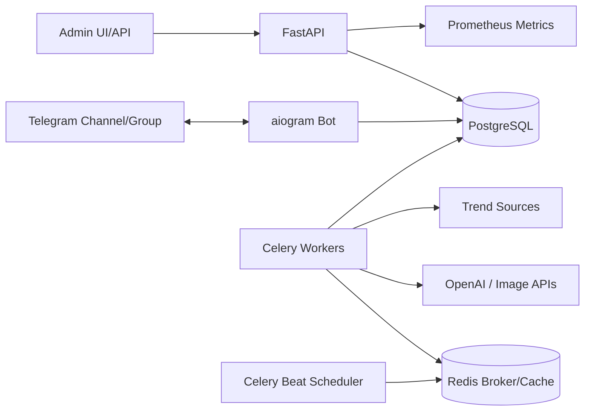

# Autonomous Telegram AI Bot

Production-oriented scaffold for an autonomous, policy-safe Telegram AI bot that plans content, generates posts/images, schedules publications, moderates chats, tracks analytics, runs giveaways, and exposes an admin API.

> Safety note: the implementation intentionally avoids spam, fake engagement, scraping behind logins, ban evasion, and unsolicited mass messaging. Growth automations are limited to compliant content, referrals, partnerships configured by admins, and Telegram API rate limits.

## Architecture



## Quick start

```bash
cp .env.example .env
docker compose up --build
```

Apply migrations:

```bash
docker compose exec api alembic upgrade head
```

Run tests locally:

```bash
python -m pip install -e '.[dev]'
pytest
```

## Main capabilities

- Autonomous strategy loop: multi-source trend intake -> memory retrieval -> idea scoring -> generation -> schedule -> publish -> analytics -> strategy update.
- AI moderation with deterministic rules, reputation scoring and optional LLM classification.
- Content queue, anti-duplicate hashing, adaptive scheduler, Telegram retry-aware publishing.
- AI memory/RAG primitives for audience interests, winning hooks, style rules and content learnings.
- Referral links, gamification score ledger, leaderboard and giveaway winner selection.
- Monetization campaign records and transparent sponsored post generation.
- Prometheus metrics, structured JSON logs, Docker/Nginx, CI, Alembic migrations, Kubernetes manifests.

See `docs/ARCHITECTURE.md` and `docs/ROADMAP.md` for details.
