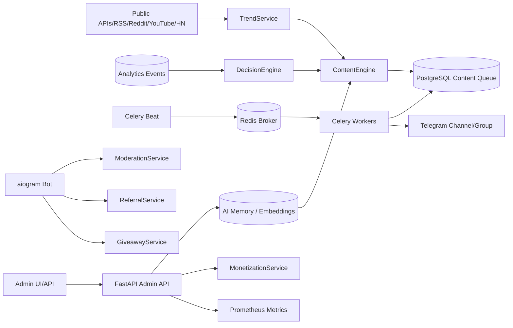

# Autonomous Telegram AI Bot — production architecture

This repository now implements a modular autonomous Telegram operating system: content factory,
AI memory, trend intelligence, moderation, referrals/gamification, giveaways, monetization,
analytics, scheduling and deployment primitives. The system is intentionally compliant: it does
not implement fake engagement, spam, ban evasion, unsolicited DMs or private scraping.

## Runtime topology

## Bounded contexts

| Context | Responsibility | Key files |
| --- | --- | --- |
| API/Admin | Admin dashboard API, rate limits, auth, manual overrides | `app/main.py`, `app/api/v1/*` |
| Bot | Telegram inbound handling, commands, moderation | `app/bot/*` |
| Content AI | trend discovery, prompts, images, dedupe, queue | `app/services/content_engine.py` |
| Memory/RAG | embeddings, style/audience memory, retrieval context | `app/models/memory.py`, `app/services/memory.py` |
| Moderation | deterministic checks + LLM classification + reputation | `app/services/moderation.py` |
| Referrals/Gamification | invite attribution, score ledger, leaderboard | `app/models/growth.py`, `app/services/referrals.py` |
| Giveaways | entries, weighted winner selection, points | `app/models/giveaway.py`, `app/services/giveaways.py` |
| Monetization | disclosed sponsored posts and campaign drafts | `app/services/monetization.py` |
| Analytics | event stream and strategy signals | `app/services/analytics.py` |
| Workers | scheduler, publishing, autonomous cycles | `app/workers/*` |

## Autonomous loop

1. Collect public trends from allowed APIs/RSS/public JSON endpoints.
2. Deduplicate and score candidates by source score, novelty and audience fit.
3. Retrieve AI memory: winning hooks, audience interests, style rules and content learnings.
4. Generate strategy JSON, post Markdown and image prompt through the AI provider abstraction.
5. Generate or attach an image, hash the post and store it in the content queue.
6. Adaptive scheduler selects the next safe slot from historical engagement, with minimum gaps.
7. Celery workers publish due content through aiogram and respect Telegram retry-after errors.
8. Analytics events update strategy signals; the decision engine adapts queue depth and formats.
9. Memory stores learnings so future posts use stronger hooks and avoid weak patterns.

## Admin panel contract

A frontend can consume these backend endpoints:

- `GET /api/v1/content` — content queue.
- `POST /api/v1/content` — manual content creation.
- `POST /api/v1/content/generate` — autonomous AI post generation.
- `POST /api/v1/content/{id}/approve` — manual override.
- `POST /api/v1/memory` and `POST /api/v1/memory/search` — AI memory/RAG control.
- `POST /api/v1/giveaways` and `POST /api/v1/giveaways/{id}/pick-winner` — giveaways.
- `POST /api/v1/referrals/links`, `GET /api/v1/referrals/leaderboard` — growth mechanics.
- `POST /api/v1/monetization/campaigns/{id}/generate-ad` — disclosed sponsored drafts.
- `GET /api/v1/analytics/summary` — dashboard KPIs.
- `GET /api/v1/growth/experiments` — compliant growth experiments.

## Safety guardrails

- No unsolicited direct messages or mass invitations.
- No fake engagement, credential harvesting, ban evasion, private scraping or proxy-based abuse.
- Growth is limited to consent-based referrals, transparent partner posts and community mechanics.
- Admin-configured channels/groups only.
- Rate-limited API, Telegram retry handling, content deduplication and safe scheduler gaps.
- Secret values are environment variables/Kubernetes Secrets, never committed.

## Production scaling strategy

- Scale `api` horizontally behind Nginx/Ingress.
- Scale Celery workers by queues: `strategy`, `publishing`, `moderation`, `analytics`.
- Use PostgreSQL read replicas for dashboards and partition `analytics_events` by month.
- Replace JSONB fallback embeddings with pgvector/Qdrant for high-volume semantic search.
- Add HPA on CPU, queue latency, Redis queue depth and Telegram publish lag.
- Add object storage/CDN for generated images and cache public trend responses.
- Add Prometheus + Grafana + Loki/Sentry + Alertmanager in production clusters.
